# 本科生毕业设计

**中文题目**　MiroFish多智能体仿真预测系统的设计与实现

**外文题目**　Design and Implementation of MiroFish Multi-Agent Simulation and Prediction System

**学　　号**　

**姓　　名**　

**学　　院**　人工智能学院

**专　　业**　计算机科学与技术

**指导教师**　

**完成时间**　2026年6月

**江西师范大学教务处制**

---

## 声　　明

本人郑重声明：

所呈交的毕业设计（论文）是本人在指导教师指导下进行的研究工作及取得的研究成果。其中除加以标注和致谢的地方，以及法律规定允许的之外，不包含其他人已经发表或撰写完成并以某种方式公开过的研究成果，也不包含为获得其他教育机构的学位或证书而作的材料。其他同志对本研究所做的任何贡献均已在文中作了明确的说明并表示谢意。

本毕业设计（论文）成果是本人在江西师范大学读书期间在指导教师指导下取得的，成果归江西师范大学所有。

特此声明。

声明人（毕业设计（论文）作者）学号：

声明人（毕业设计（论文）作者）签名：

签名日期：　　　年　　月　　日

---

## 摘　　要

随着社交媒体在全球范围内的深度渗透，Twitter、Reddit 等平台每天产生数以亿计的用户交互数据，其传播路径与群体反应直接影响品牌营销、产品发布、政策制定等重大决策。然而，传统的舆情分析工具普遍存在回溯性强、缺乏前瞻能力、无法定制化推演等局限。本文设计并实现了一款多智能体仿真预测引擎——MiroFish。该系统以用户上传的种子文档和自然语言预测需求为输入，依次完成本体抽取、知识图谱构建、Agent 人设生成、Twitter 与 Reddit 双平台仿真运行，最终产出可交互的结构化预测报告。系统采用 Vue 3 加 Flask 的前后端分离架构，集成大语言模型（LLM）与 CAMEL-AI/OASIS 多智能体仿真框架，以 Zep Cloud 作为知识图谱存储后端。本文依据软件工程规范，依次完成需求分析、系统设计和系统实现的全过程论述。其中，需求分析阶段采用用例驱动方法，识别出十个核心用例并构建了完整的用例模型与分析类模型；系统设计阶段采用分层架构风格，将系统划分为表现层、业务逻辑层、数据访问层与实体层，并完成了全部用户界面的详细设计。

**关键字：** 多智能体仿真；知识图谱；社交媒体预测；大语言模型；OASIS

---

## Abstract

With the deep penetration of social media worldwide, platforms such as Twitter and Reddit generate hundreds of millions of user interactions daily. The propagation paths and collective behavioral patterns on these platforms directly impact major decisions in brand marketing, product launches, and policy formulation. However, traditional sentiment analysis tools are predominantly retrospective, lacking forward-looking capabilities and customizable simulation features. This paper presents the design and implementation of MiroFish, a multi-agent simulation and prediction engine. The system takes user-uploaded seed documents and natural language prediction requirements as input, and sequentially performs ontology extraction, knowledge graph construction, agent profile generation, dual-platform (Twitter and Reddit) simulation, and interactive report generation. The system adopts a Vue 3 plus Flask front-end and back-end separation architecture, integrating Large Language Models (LLM) with the CAMEL-AI/OASIS multi-agent simulation framework, and uses Zep Cloud as the knowledge graph storage backend. This paper follows software engineering standards to systematically complete requirements analysis, system design, and system implementation. In the requirements analysis phase, a use-case-driven approach is adopted to identify ten core use cases and construct a complete use case model and analysis class model. In the system design phase, a layered architecture is employed to partition the system into presentation, business logic, data access, and entity layers, with detailed designs for all user interfaces.

**Keywords:** Multi-Agent Simulation; Knowledge Graph; Social Media Prediction; Large Language Model; OASIS

---

## 目　　录

摘要

Abstract

第一章 绪论

　　1.1 系统的开发背景

　　1.2 系统的意义

　　1.3 项目简介

第二章 需求分析

　　2.1 功能需求

　　2.2 用例交互

　　2.3 分析类图

　　2.4 非功能性需求分析

　　2.5 本章小结

---

## 第一章 绪论

### 1.1 系统的开发背景

在数字化时代，社交媒体已成为公共舆论形成、商业信息扩散与社会事件演化的核心场域。Twitter、Reddit 等平台每日产生数以亿计的用户互动，其传播路径与群体行为模式对品牌营销、产品发布、政策出台、危机公关等重大决策具有深远影响。然而，当前主流的舆情分析工具和社交媒体监测手段普遍存在以下四大局限：

第一，回溯性而非前瞻性。现有工具主要基于历史文本数据进行情感分析与关键词统计，只能解释"已经发生了什么"，无法回答"如果这样做会发生什么"。这种被动的分析范式难以满足决策者对前瞻性推演的需求。

第二，缺少群体动力学建模。大多数工具仅对单条内容进行情感打分，忽略了社交媒体中用户之间的关注关系、转发链路、信息级联效应以及子社区演化等群体动力学特征。

第三，无法定制化推演。用户的预测需求高度个性化，涉及特定行业、特定人群、特定话题、特定平台。通用的舆情模型难以快速适配不同领域的专业术语、特定人群的交流风格和垂直行业的传播规律。

第四，报告产出僵化。传统工具输出固定模板的分析报告，决策者无法就其中的关键发现进一步追问、深挖或探索假设性情景，报告与决策之间存在显著的交互鸿沟。

随着大语言模型（Large Language Model，简称 LLM）技术的飞速发展和多智能体仿真框架（如 CAMEL-AI/OASIS）的日益成熟，构建"可前瞻、可定制、可交互"的社交媒体推演引擎在技术层面已成为可能。MiroFish 项目正是在这一技术背景下立项，旨在探索 LLM 驱动的端到端社交媒体传播预测范式。

### 1.2 系统的意义

MiroFish 作为一款多智能体仿真预测引擎，其核心工作流为：用户上传种子文档并以自然语言描述预测需求，系统自动完成本体抽取、知识图谱构建、Agent 人设生成、Twitter 与 Reddit 双平台 OASIS 仿真运行、预测报告生成与深度交互问答。其意义体现在以下四个层面：

在方法学价值方面，本系统将 LLM 驱动的本体生成、知识图谱推理与多智能体社会仿真三大技术整合为统一流水线，验证"文档到图谱到人设到仿真到报告"的端到端预测范式的可行性，为 AI 驱动的社会科学仿真研究提供新思路。

在应用价值方面，本系统为品牌运营者、内容创作者、舆情研究人员、市场分析师提供低门槛、可定制的社交传播推演工具，支持发布前的策略评估与风险规避，有效降低决策试错成本。

在产品价值方面，相较于静态 BI 报表和传统舆情分析工具，MiroFish 提供可交互的预测报告——用户可通过对话式界面追问任意子结论、采访任意虚拟 Agent，将单向的报告消费模式升级为双向的探索式决策支持体验。

在技术价值方面，本系统探索了 LLM Agent 与子进程隔离、文件 IPC 相结合的工程化模式，为长时运行、可中断、可追问的 AI 应用提供参考实现，对类似系统的工程架构设计具有借鉴意义。

### 1.3 项目简介

MiroFish 是一个面向社交媒体传播预测的多智能体仿真引擎。系统围绕"五步用户流水线"组织核心业务，用户仅需上传种子文档并描述预测需求，即可驱动整条自动化流水线运转。

第一步，项目与文档管理。用户创建预测项目并上传种子文档（支持 PDF、DOCX、TXT 格式），系统自动解析文档并将文本合并持久化。

第二步，本体与图谱构建。系统调用大语言模型从文档中抽取本体定义（实体类型与关系类型），随后以异步方式构建知识图谱并写入 Zep Cloud 图数据库。前端以 D3 力导向图实时渲染图谱可视化。

第三步，环境搭建与人设生成。系统从知识图谱中读取全部实体，调用大语言模型为每个实体生成 Twitter 与 Reddit 双平台的 Agent 人设（包含背景故事、性格特征、兴趣偏好、立场倾向等维度），并自动生成 OASIS 仿真引擎所需的全套配置文件。

第四步，仿真运行与监控。系统以独立子进程方式启动 OASIS 仿真引擎，Agent 按照各自人设在虚拟社交媒体环境中进行推文发布、转发、回复等行为。前端实时轮询展示运行状态、回合进展和动作时间线。

第五步，报告生成与深度交互。仿真结束后，ReportAgent 智能体自动读取仿真产物，规划报告大纲并逐章生成结构化预测报告，通过 SSE 流式推送至前端。用户还可进一步对仿真中的任意 Agent 进行采访，或就报告内容与 ReportAgent 进行深度对话。

在技术架构方面，系统前端采用 Vue 3 加 Vite 加 Vue Router 构建单页应用，后端采用 Python Flask 应用工厂模式组织 RESTful API，前后端通过 HTTP 与 SSE 通信。大语言模型接口遵循 OpenAI 兼容规范，支持灵活切换模型提供商。仿真引擎基于 CAMEL-AI/OASIS 多智能体框架，以独立子进程方式运行并通过文件 IPC 与 Flask 主进程通信。系统不引入传统关系型数据库，所有状态以文件形式落盘于后端 uploads 目录下，依项目、仿真、报告三类实体分层组织。

在论文组织方面，本文共分六章。第一章绪论，阐述系统的开发背景、意义与项目概况。第二章需求分析，采用用例驱动方法对系统进行全面的功能性与非功能性需求分析。第三章系统设计，详述体系结构设计与用户界面设计。第四章系统实现，介绍核心模块的开发实现过程。第五章系统维护，说明系统部署与运维方案。第六章总结，对全文工作进行总结与展望。

---

## 第二章 需求分析

### 2.1 功能需求

本节以自然语言形式逐条描述 MiroFish 系统的核心功能需求，涵盖从项目创建到深度交互的完整业务流程。每条需求包含编号、功能描述与关键约束。在此基础上，采用用例驱动的分析方法构建用例模型，识别出十个核心用例并绘制用例图。

**FR-1 创建项目与上传文档。** 用户应能够创建一个新的预测项目，并上传一个或多个种子文档（支持 PDF、DOCX、TXT 格式）。系统应自动解析文档内容并将合并后的文本持久化至项目目录。约束条件：单项目至少接受一份文档；文档解析失败时，项目状态应置为 FAILED 并向前端返回明确的错误信息，用户可重新上传有效文档。

**FR-2 项目管理。** 用户应能够浏览全部历史项目、查看项目详情（包括项目名称、当前状态、图谱编号、创建时间）、删除不再需要的项目。删除项目时，系统须同步清理对应 uploads 目录下的所有关联文件。约束条件：项目状态遵循 CREATED 到 ONTOLOGY_GENERATED 到 GRAPH_BUILDING 到 GRAPH_COMPLETED 的正向推进路径，任意状态均可因异常降级为 FAILED；删除操作不可逆，前端须做二次确认。

**FR-3 生成本体定义。** 系统应基于种子文档的合并文本，调用大语言模型自动抽取候选实体类型与关系类型。生成结果返回前端后，用户可在本体编辑器中手动增删改，确认后持久化保存。约束条件：本体必须由大语言模型进行语义抽取，不得使用规则模板或关键词匹配替代；大语言模型调用失败时，项目状态须回滚至 CREATED 并向用户返回错误描述。

**FR-4 构建知识图谱。** 系统应基于已确认的本体定义，以异步方式构建知识图谱——从文档文本中抽取三元组（主体-关系-客体）并逐批写入 Zep Cloud 图数据库。前端通过任务标识符轮询构建进度，构建完成后获取图谱标识符用于后续流程。约束条件：构建任务以 Python daemon 线程承载，严禁阻塞 Flask 主线程；Zep Cloud 写入失败时，任务状态标记为 FAILED 并同步项目状态。

**FR-5 生成 Agent 人设。** 系统应从 Zep Cloud 知识图谱中读取全部实体，调用大语言模型为每个实体生成 Twitter 与 Reddit 双平台的 Agent 人设档案。每份人设应涵盖背景故事、性格特征、兴趣偏好、立场倾向四个维度。约束条件：两份人设文件（twitter_profiles.json 与 reddit_profiles.json）必须分别落盘至对应仿真目录；图谱实体数量不足以支撑仿真时，系统应提示用户返回图谱构建阶段补充。

**FR-6 生成模拟配置。** 用户应能够配置仿真参数，包括运行回合数（默认 5 轮）、参与 Agent 数量上限、初始讨论话题文本、各平台（Twitter 与 Reddit）启用开关。系统应校验参数完整性并与已有的人设数据合并，生成最终的 simulation_config.json 配置文件。约束条件：配置生成必须在人设生成之后执行；缺失任意平台的人设文件时，系统应拒绝进入仿真阶段并给出明确提示。

**FR-7 启动并监控仿真。** 用户应能够启动仿真并实时查看运行状态、当前回合进展与 Agent 动作时间线。前端以固定间隔轮询后端接口获取最新数据。约束条件：仿真必须以 subprocess.Popen 方式启动独立的 Python 子进程，严禁在 Flask 主进程内直接运行 OASIS 仿真循环；子进程启动失败时应清理已创建的资源并返回错误信息。

**FR-8 仿真后挂起等待。** 全部回合运行完毕后，仿真子进程应自动进入"等待命令模式"持续监听后续采访指令，而非直接退出。约束条件：用户主动关闭仿真环境前子进程不得退出；Flask 服务器关闭时，由 atexit 注册的清理钩子统一遍历并终止所有活跃子进程，杜绝孤儿进程的产生。

**FR-9 生成预测报告。** 仿真产物（actions.jsonl 等文件）就绪后，ReportAgent 智能体应自动读取仿真数据，规划报告大纲并以章节为单位迭代写作。报告内容落盘后通过 SSE（Server-Sent Events）流式接口向前端增量推送，用户无需等待全部章节完成即可开始阅读。约束条件：章节写作因大语言模型调用超时或返回异常而失败时，当前章节标记为 FAILED 并支持用户触发重试，不影响已完成章节。

**FR-10 采访 Agent。** 用户应能够从仿真 Agent 列表中选定任意数量的 Agent，以自然语言向其提问。系统通过文件 IPC 通道将采访命令转发至仿真子进程，由子进程驱动目标 Agent 基于其人设与仿真历史调用大语言模型生成角色化回答。约束条件：IPC 命令类型需覆盖 INTERVIEW（单 Agent 采访）、BATCH_INTERVIEW（批量采访）、CLOSE_ENV（关闭仿真环境）三种；采访超时或子进程无响应时，系统应返回超时错误并允许用户重试。

**FR-11 与报告对话。** 用户应能够在报告查看页面就任意子结论与 ReportAgent 进行自然语言对话。ReportAgent 应基于已生成的报告全文上下文理解用户问题并调用大语言模型生成回答。必要时可触发对仿真子进程的二次采访以补充信息。约束条件：报告对话功能独立于仿真子进程，通过 /api/report/chat 接口实现；仿真子进程已关闭时，对话功能仅基于已写报告内容回答，不得因无法采访而报错中断。

**FR-12 系统基础能力。** 系统应提供 /health 健康检查接口供运维监控使用，并在所有 /api/* 路径上开启 CORS（跨域资源共享）以支持前后端分离部署。约束条件：CORS 配置仅对 /api/* 路径生效，其他路径不开放跨域访问；健康检查接口须在应用启动后立即可用。

在上述功能性需求的基础上，本节采用用例驱动的分析方法构建用例模型。用例图如图 2-1 所示，该图从整体视角刻画了用户与系统之间的交互边界以及十个核心用例之间的包含与扩展关系。

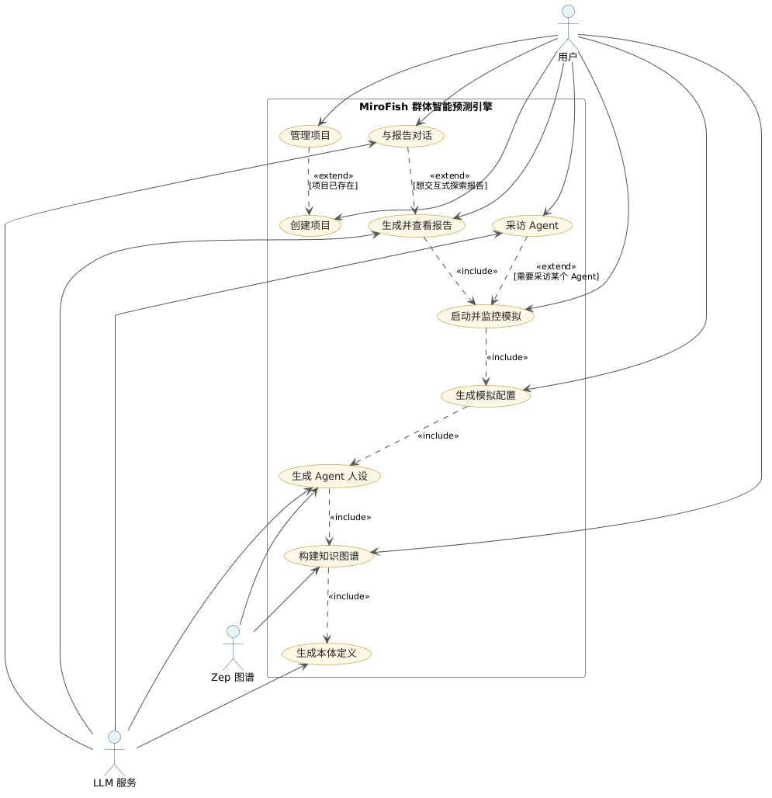

**图 2-1 MiroFish 系统用例图**

经对系统边界的分析，本系统识别出三类参与者。其一为用户（User），是系统的主参与者，代表使用 MiroFish 进行社交媒体传播预测的业务方，参与全部十个用例的交互。其二为 LLM 服务，是辅助参与者，为外部 OpenAI 兼容格式的大语言模型接口，在本体抽取、人设生成、报告写作和对话推理等环节被调用。其三为 Zep 图谱（Zep Cloud），是辅助参与者，为外部知识图谱云服务，承担实体节点与关系边的存储与检索。OASIS 仿真引擎、ReportAgent、SimulationRunner 等均为系统内部组件（表现为子进程或服务类），不在用例模型中作为独立参与者出现。

如图 2-1 所示，本系统共识别出十个用例。用例之间的 include 关系体现了主流水线中用例的必要依赖：UC-04（构建知识图谱）依赖 UC-03（生成本体定义）产出的本体定义，UC-05（生成 Agent 人设）依赖 UC-04 构建的知识图谱，UC-06（生成模拟配置）依赖 UC-05 生成的人设数据，UC-07（启动并监控模拟）依赖 UC-06 产出的仿真配置，UC-08（生成并查看报告）依赖 UC-07 产出的仿真产物。以上依赖均为必经路径，缺失前置用例的产出则后续用例无法执行。用例之间的 extend 关系体现了可选触发的扩展行为：UC-02（管理项目）扩展 UC-01（创建项目），用户在创建项目后可选择进入项目管理界面执行查看或删除操作；UC-09（采访 Agent）扩展 UC-07（启动并监控模拟），仿真完成后用户可选择进入采访模式；UC-10（与报告对话）扩展 UC-08（生成并查看报告），报告生成后用户可选择进入对话交互模式。

以下对十个核心用例逐一进行详细描述，每个用例说明其主参与者、前置条件、后置条件、主流程与备选流程。

**UC-01 创建项目。** 主参与者为用户。前置条件为后端服务处于可用状态。后置条件为项目目录成功创建，项目状态置为 CREATED，种子文档经解析后合并为 extracted_text.txt 落盘，project.json 持久化完成。主流程为：用户填写项目名称；用户上传一份或多份种子文档；后端逐份解析文档文本并合并；后端将项目元信息与合并文本分别持久化，向前端返回项目标识。备选流程：若文档解析失败（文件损坏或格式不支持），后端将项目状态置为 FAILED 并返回具体错误信息。

**UC-02 管理项目。** 主参与者为用户。前置条件为系统中至少存在一个项目。后置条件为查看操作返回项目完整元数据，删除操作清理项目目录后刷新列表。主流程为：用户进入首页项目管理界面；前端拉取全部项目列表并渲染；用户点击目标项目查看详情或点击删除按钮；后端执行对应操作并返回结果，前端刷新列表。备选流程：若删除操作因文件系统错误失败，后端保留项目记录并向用户提示删除失败请重试。

**UC-03 生成本体定义。** 主参与者为用户。前置条件为 UC-01 已完成且 extracted_text.txt 存在。后置条件为项目状态推进至 ONTOLOGY_GENERATED，本体定义写入 project.json。主流程为：用户点击"生成本体"按钮；后端 OntologyGenerator 读取文档文本并调用 LLM 抽取候选实体类型与关系类型；后端解析 LLM 返回的本体 JSON 数据；将本体定义持久化并返回前端展示；用户在本体编辑器中审阅修改并保存确认。备选流程：若 LLM 调用失败（超时、配额耗尽或返回格式异常），项目状态回滚至 CREATED 并向用户返回错误描述。

**UC-04 构建知识图谱。** 主参与者为用户。前置条件为 UC-03 已完成且本体定义可用。后置条件为项目状态推进至 GRAPH_COMPLETED，图谱标识符写回 project.json。主流程为：用户点击"构建图谱"按钮；后端生成任务标识符并创建 daemon 线程异步执行构建，立即向前端返回任务标识符；构建线程从文档中抽取三元组，逐批写入 Zep Cloud；前端以固定间隔轮询任务进度直至状态变为 COMPLETED；前端获取图谱标识符后以 D3 力导向图渲染可视化。备选流程：若 Zep Cloud 写入失败（网络异常或认证错误），任务状态标记为 FAILED 并同步项目状态。

**UC-05 生成 Agent 人设。** 主参与者为用户。前置条件为 UC-04 已完成且图谱标识符有效。后置条件为仿真目录下生成 twitter_profiles.json 与 reddit_profiles.json 两份人设文件。主流程为：用户点击"生成 Agent 人设"；后端 ZepEntityReader 通过图谱标识符从 Zep Cloud 拉取全部实体列表；OasisProfileGenerator 为每个实体构造提示词，调用 LLM 分别生成 Twitter 平台人设（短文本、话题标签风格）与 Reddit 平台人设（长篇分析、社区讨论风格）；将双平台人设分别持久化并向前端返回人设摘要列表供预览。备选流程：若拉取到的实体数量不足，系统提示用户图谱实体不够充分，需返回 UC-04 阶段完善。

**UC-06 生成模拟配置。** 主参与者为用户。前置条件为 UC-05 已完成且两份人设文件均存在。后置条件为 simulation_config.json 文件落盘于仿真目录。主流程为：用户填写回合数、Agent 数量上限、初始话题文本、平台启用开关等参数；后端 SimulationConfigGenerator 读取人设文件，校验参数完整性与合法性，将参数与人设数据合并为 OASIS 引擎所需的完整配置结构；将最终配置持久化并返回仿真标识。备选流程：若校验发现必填字段缺失或参数值超出合法范围，后端返回 HTTP 422 状态码并指明需补全的具体字段。

**UC-07 启动并监控模拟。** 主参与者为用户。前置条件为 UC-06 已完成且 simulation_config.json 存在且格式有效。后置条件为仿真子进程启动成功，每轮动作流水写入 actions.jsonl，仿真完成后子进程进入等待命令模式挂起。主流程为：用户点击"启动仿真"按钮；后端 SimulationRunner 通过 subprocess.Popen 启动 run_parallel_simulation.py 子进程；前端跳转至仿真监控界面，以固定间隔轮询运行状态与动作时间线；子进程每完成一轮仿真即向 actions.jsonl 追加动作记录；全部回合运行完毕后子进程进入等待命令模式，前端展示仿真完成状态。备选流程有两个：若子进程因系统资源不足启动失败，SimulationRunner 抛出错误并清理已创建的半成品文件；若用户在仿真运行期间点击停止，后端向子进程发送 CLOSE_ENV 命令终止运行。

**UC-08 生成并查看报告。** 主参与者为用户。前置条件为 UC-07 已完成且 actions.jsonl 可读。后置条件为报告目录下各章节 Markdown 文件依次落盘，progress.json 状态标记为 COMPLETED。主流程为：用户点击"生成报告"按钮；后端实例化 ReportAgent 智能体并传入仿真标识；ReportAgent 读取仿真产物后自主规划报告大纲；ReportAgent 进入逐章迭代写作循环，每轮调用 LLM 生成一个章节内容并落盘，同步更新 progress.json 中的进度；前端通过 SSE 流式接口连接报告生成端点，每当有新章节完成即增量推送并渲染。备选流程：若某章节因 LLM 调用超时或返回内容异常写作失败，ReportAgent 将该章节标记为 FAILED，前端展示"本章节生成失败，点击重试"，重试仅针对失败章节。

**UC-09 采访 Agent。** 主参与者为用户。前置条件为 UC-07 已完成且仿真子进程处于等待命令模式。后置条件为采访结果写入 ipc_responses 目录下的响应文件并转发至前端。主流程为：用户在采访界面选定目标 Agent 并输入自然语言问题；前端将采访请求发送至后端 /api/simulation/interview 接口；后端 SimulationIPCClient 将命令序列化为 JSON 格式的 INTERVIEW 或 BATCH_INTERVIEW 命令文件写入 ipc_commands 目录；仿真子进程轮询检测到新命令后读取内容，驱动目标 Agent 以自身人设和仿真历史为上下文调用 LLM 生成角色化回答；子进程将回答写入 ipc_responses 目录下的对应响应文件；后端轮询检测到响应文件后读取内容并返回前端展示。备选流程：若子进程在预设超时时间内未生成响应，后端返回超时错误码，前端提示用户可选择重试或发送 CLOSE_ENV 命令关闭仿真环境。

**UC-10 与报告对话。** 主参与者为用户。前置条件为 UC-08 已完成且报告目录下存在至少一个已完成的章节。后置条件为对话记录追加至 agent_log 目录下的日志文件中。主流程为：用户在报告页对话区域输入自然语言问题；后端 ReportAgent.chat 方法读取全部已完成章节作为上下文，连同用户问题构造提示词调用 LLM 生成回答；将本轮对话记录追加至日志文件；后端将回答返回前端并在对话面板中展示。可选扩展：若用户追问需获取仿真细节而报告正文未覆盖，ReportAgent 可构造二次采访请求通过 IPC 通道向仿真子进程发送采访命令，获取 Agent 回答后整合进对话回复。备选流程：若仿真子进程已被关闭，ReportAgent 仅基于已生成的报告正文内容回答问题，对于需子进程在线才能回答的问题告知用户仿真环境已关闭。

### 2.2 用例交互

本节为上述十个用例逐一绘制顺序图，按时间顺序刻画参与者与系统组件之间的消息交互流程。所有顺序图均采用 UML 序列图规范绘制，图中以 actor 表示用户参与者，以 boundary 表示界面边界类，以 control 表示业务控制类，以 entity 表示数据实体类。每个用例对应一张顺序图，共十张，编号与第 2.1 节用例描述一一对应。

**UC-01 创建项目**

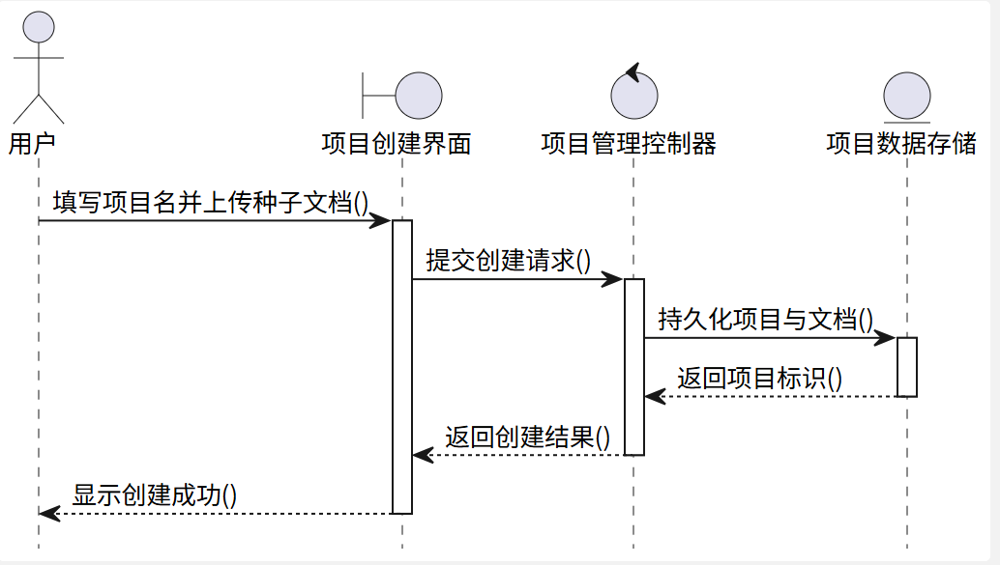

**图 2-2 UC-01 创建项目顺序图**

该顺序图展示了用户从填写项目名称、上传种子文档，到后端解析文档、持久化项目数据并返回创建结果的完整消息交互序列。用户首先与项目创建界面交互提交项目信息与文档，界面将创建请求转发至项目管理控制器，控制器依次执行文档解析与数据持久化操作，最终逐层返回结果至用户界面展示。

**UC-02 管理项目**

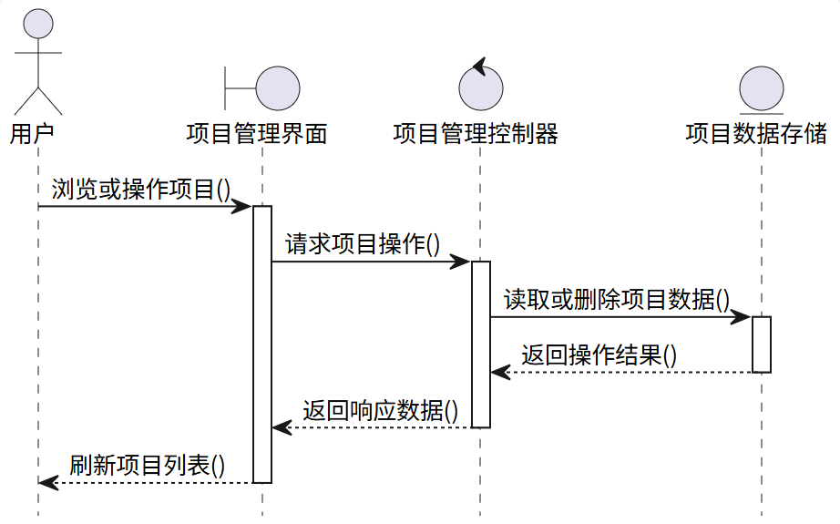

**图 2-3 UC-02 管理项目顺序图**

该顺序图展示了用户浏览项目列表、查看详情或删除项目时的消息流。项目管理界面将用户的操作请求转发至控制器，控制器访问项目数据存储执行对应的查询或删除操作，操作完成后逐层返回结果并触发前端列表刷新。

**UC-03 生成本体定义**

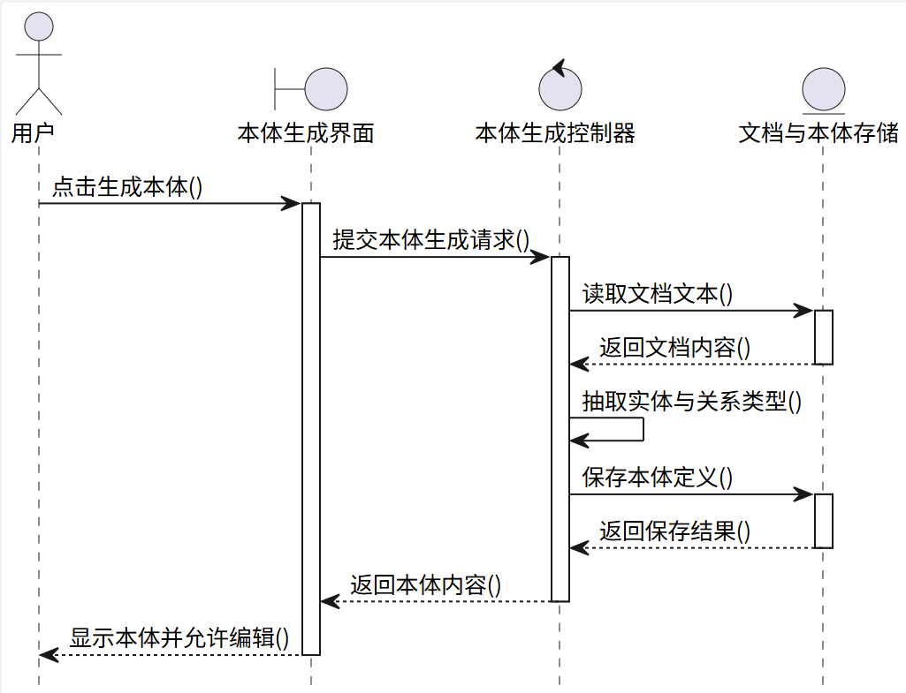

**图 2-4 UC-03 生成本体定义顺序图**

该顺序图展示了本体生成的完整流程。用户点击"生成本体"按钮后，控制器首先从数据存储中读取种子文档的合并文本，然后调用本体生成逻辑（内部调用 LLM 服务完成实体与关系类型的语义抽取），最后将生成的本体定义持久化至存储并返回前端供用户编辑确认。

**UC-04 构建知识图谱**

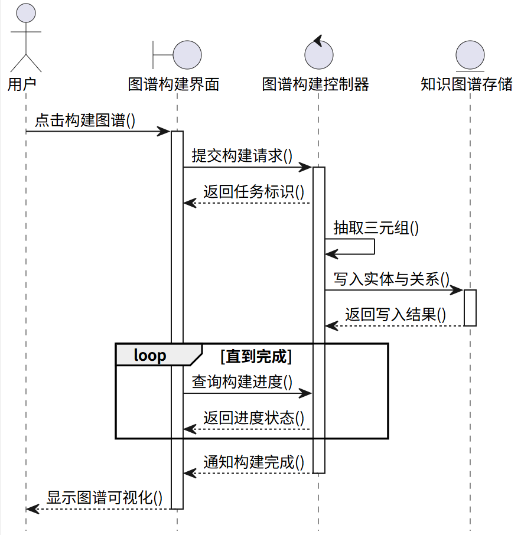

**图 2-5 UC-04 构建知识图谱顺序图**

该顺序图展示了异步图谱构建的交互流程。用户触发构建后，控制器立即返回任务标识符并异步执行三元组抽取与 Zep Cloud 写入。前端进入轮询循环，定期向控制器查询构建进度，直至收到"构建完成"通知后驱动界面展示图谱可视化结果。

**UC-05 生成 Agent 人设**

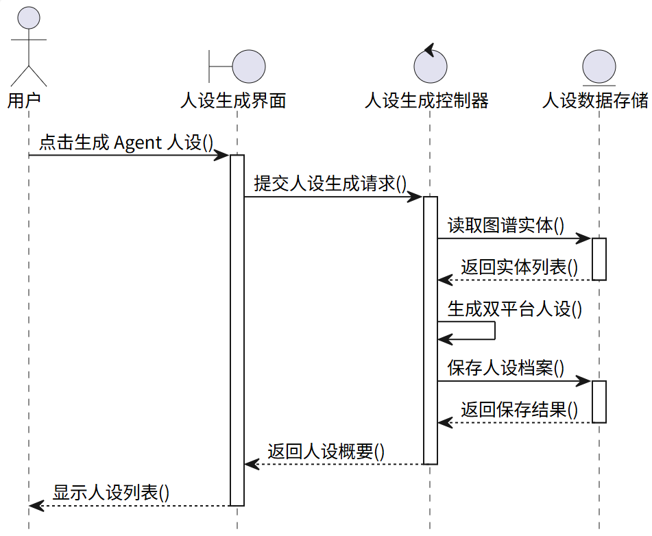

**图 2-6 UC-05 生成 Agent 人设顺序图**

该顺序图展示了从图谱到人设的数据流转过程。人设生成控制器首先从数据存储中读取图谱实体列表，然后调用人设生成逻辑（内部调用 LLM 服务为每个实体生成 Twitter 与 Reddit 双平台人设档案），最后将生成的人设持久化至存储并向前端返回人设摘要列表。

**UC-06 生成模拟配置**

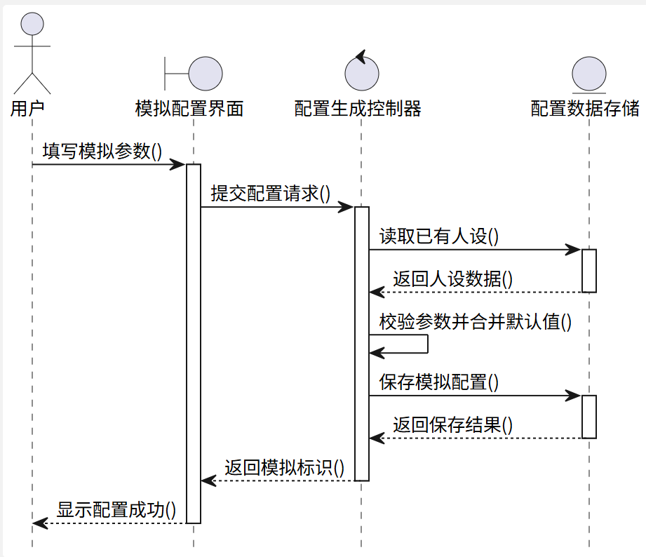

**图 2-7 UC-06 生成模拟配置顺序图**

该顺序图展示了用户配置仿真参数并生成最终配置的消息流。用户在模拟配置界面填写参数后提交，配置生成控制器首先读取已有的人设数据，然后校验用户输入参数的完整性与合法性，将参数与默认值合并后生成完整的仿真配置并持久化，最后向界面返回仿真标识。

**UC-07 启动并监控模拟**

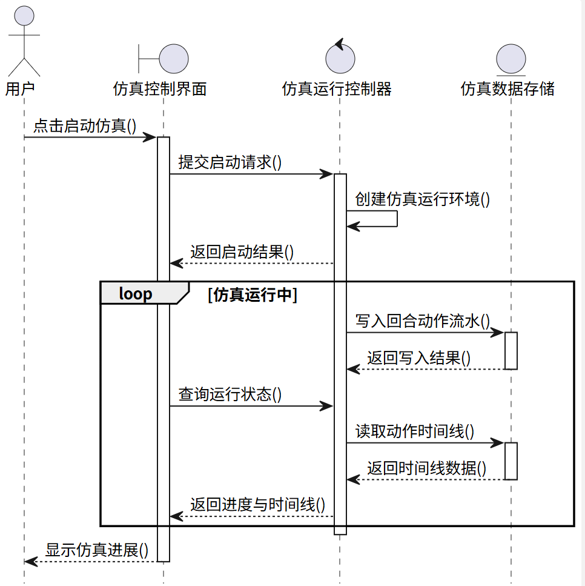

**图 2-8 UC-07 启动并监控模拟顺序图**

该顺序图展示了仿真运行期间的复合交互模式。用户启动仿真后，控制器创建仿真运行环境并立即返回启动结果。仿真运行期间形成两个并行回路：一是控制器持续向仿真数据存储写入每轮的动作流水；二是前端持续轮询控制器获取运行状态，控制器从存储中读取动作时间线数据并返回。两个回路在仿真全部回合完成后自然终止。

**UC-08 生成并查看报告**

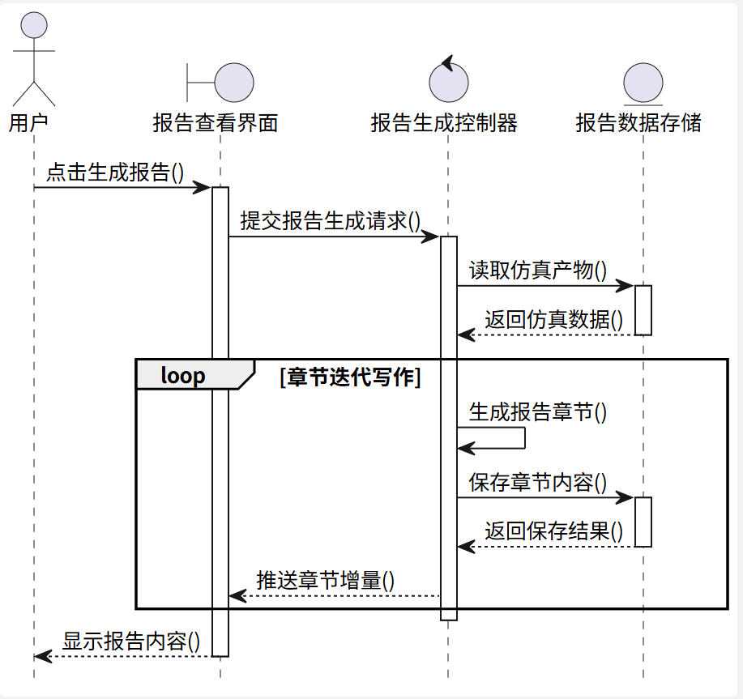

**图 2-9 UC-08 生成并查看报告顺序图**

该顺序图展示了报告流式生成的交互流程。用户触发报告生成后，控制器首先从数据存储中读取全部仿真产物，然后进入章节迭代写作循环：每生成一个章节即将其保存至存储，并向前端推送章节增量更新。该循环持续至全部章节完成，前端在每次增量推送时即时渲染新章节内容。

**UC-09 采访 Agent**

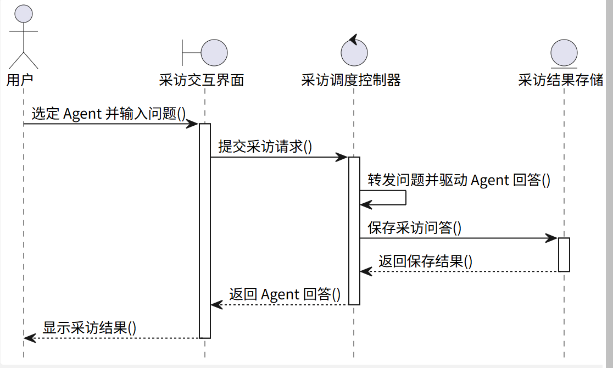

**图 2-10 UC-09 采访 Agent 顺序图**

该顺序图展示了用户采访虚拟 Agent 的消息链路。用户在采访交互界面选定目标 Agent 并输入问题后，采访调度控制器接收请求，内部完成问题转发与 Agent 回答驱动的处理（通过文件 IPC 与仿真子进程通信），将采访问答持久化保存后，将 Agent 的角色化回答返回界面展示。

**UC-10 与报告对话**

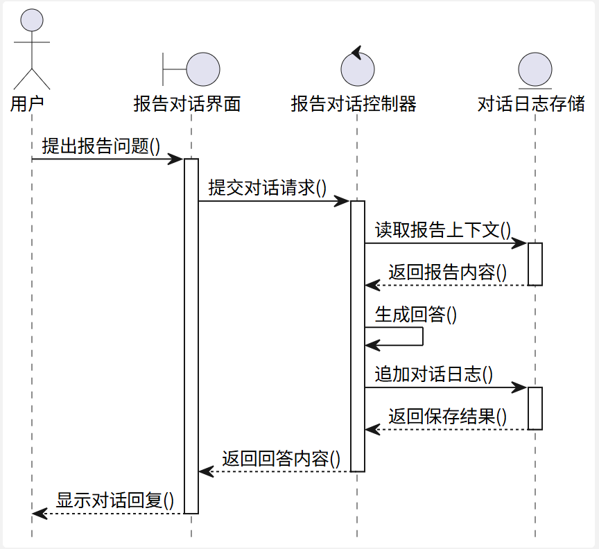

**图 2-11 UC-10 与报告对话顺序图**

该顺序图展示了报告对话交互的消息流。用户在报告对话界面提出问题后，报告对话控制器首先从数据存储中读取已生成的报告上下文内容，然后调用 LLM 服务基于报告上下文与用户问题生成回答，最后将本轮对话追加至对话日志存储并将回答返回前端展示。

### 2.3 分析类图

本节采用健壮性分析（Robustness Analysis）方法，从第 2.2 节的十张用例顺序图中提取分析类。其核心操作步骤为：逐张顺序图识别消息发送方与接收方，按边界类（Boundary）、控制类（Control）、实体类（Entity）三种构造型对参与者进行归类；将顺序图中每一条消息转译为消息接收方类的方法签名；将消息传递方向转译为类间的依赖或关联关系。

经提取与去重（跨用例共用的类予以合并），共得到十个边界类、九个控制类、九个实体类与一个外部参与者。以下按构造型分类逐一说明。

**边界类（Boundary，共 10 个）。** 边界类位于系统的表现层，每个用例对应一个独立的边界类，承担"接收用户输入"与"展示返回结果"两项职责。UI01 项目创建界面，提供填写项目名并上传种子文档、显示创建成功等方法。UI02 项目管理界面，提供浏览或操作项目、刷新项目列表等方法。UI03 本体生成界面，提供点击生成本体、显示本体并允许编辑等方法。UI04 图谱构建界面，提供点击构建图谱、查询构建进度、显示图谱可视化等方法。UI05 人设生成界面，提供点击生成 Agent 人设、显示人设列表等方法。UI06 模拟配置界面，提供填写模拟参数、显示配置成功等方法。UI07 仿真控制界面，提供点击启动仿真、查询运行状态、显示仿真进展等方法。UI08 报告查看界面，提供点击生成报告、显示报告内容等方法。UI09 采访交互界面，提供选定 Agent 并输入问题、显示采访结果等方法。UI10 报告对话界面，提供提出报告问题、显示对话回复等方法。

**控制类（Control，共 9 个）。** 控制类位于系统的业务逻辑层，封装各业务领域的核心处理逻辑。其中 UC-01 与 UC-02 共享 C01 项目管理控制器（提供提交创建请求、请求项目操作等方法），其余用例各对应一个独立控制类。C03 本体生成控制器，提供提交本体生成请求、抽取实体与关系类型等方法。C04 图谱构建控制器，提供提交构建请求、抽取三元组、查询构建进度等方法。C05 人设生成控制器，提供提交人设生成请求、生成双平台人设等方法。C06 配置生成控制器，提供提交配置请求、校验参数并合并默认值等方法。C07 仿真运行控制器，提供提交启动请求、创建仿真运行环境、查询运行状态等方法。C08 报告生成控制器，提供提交报告生成请求、生成报告章节等方法。C09 采访调度控制器，提供提交采访请求、转发问题并驱动 Agent 回答等方法。C10 报告对话控制器，提供提交对话请求、生成回答等方法。

**实体类（Entity，共 9 个）。** 实体类位于系统的数据访问层，封装对底层数据存储的读写操作抽象。E01 项目数据存储（UC-01 与 UC-02 共用），提供持久化项目与文档、读取或删除项目数据等方法。E03 文档与本体存储，提供读取文档文本、保存本体定义等方法。E04 知识图谱存储，提供写入实体与关系等方法。E05 人设数据存储（UC-05 与 UC-06 共用），提供读取图谱实体、保存人设档案等方法。E06 配置数据存储（UC-05 与 UC-06 共用），提供读取已有人设、保存模拟配置等方法。E07 仿真数据存储，提供写入回合动作流水、读取动作时间线等方法。E08 报告数据存储，提供读取仿真产物、保存章节内容等方法。E09 采访结果存储，提供保存采访问答等方法。E10 对话日志存储，提供读取报告上下文、追加对话日志等方法。

**类间关系。** 类间关系完全遵循从顺序图中提取的消息传递方向，形成以下四类关系。其一，外部参与者"用户"与全部十个边界类之间存在关联关系，表示用户通过各界面与系统进行交互。其二，每个边界类与其对应的控制类之间存在依赖关系（边界类依赖于控制类），表示界面将用户请求转发给控制器处理，其中 UI01 与 UI02 共同依赖 C01。其三，每个控制类与其所操作的实体类之间存在依赖关系（控制类依赖于实体类），表示控制器通过实体类读写持久化数据。其四，顺序图中控制类自身的内部消息（如"抽取三元组"、"生成双平台人设"等）被内化为对应控制类的私有方法，不在类图中与外部类产生交互。

**外部服务封装。** LLM 服务和 Zep Cloud 图谱作为系统外部的协作方，其调用细节被封装在控制类的内部实现中，不在分析类图中显示为独立类。具体封装关系为：C03 本体生成控制器内部调用 LLM 服务完成实体与关系类型的抽取；C04 图谱构建控制器内部调用 Zep Cloud 完成实体与关系的持久化；C05 人设生成控制器内部调用 LLM 服务完成人设档案的生成；C08 报告生成控制器内部调用 LLM 服务完成报告章节的写作；C10 报告对话控制器内部调用 LLM 服务完成对话推理。这种封装设计使业务逻辑层不直接依赖外部服务的具体 API 形态，为后续更换服务提供商或引入本地部署模型留出扩展空间。

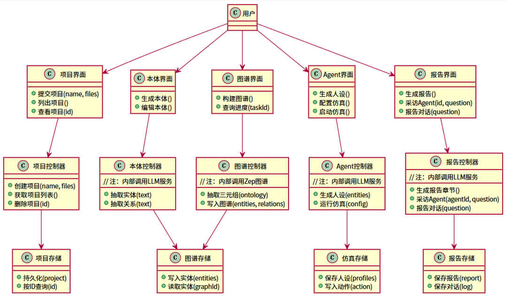

**图 2-12 MiroFish 系统分析类图**

### 2.4 非功能性需求分析

非功能性需求从性能、可靠性、可维护性、安全性、可移植性、可扩展性、兼容性、可观测性、运行环境和数据持久化等多个维度对系统质量属性提出量化约束。以下按编号逐一说明。

**NFR-1 异步性能。** 本体生成、图谱构建、报告生成等长耗时任务必须以异步或流式方式响应，严禁阻塞前端交互。具体而言：前端 axios 请求超时上限设定为 5 分钟；图谱构建采用 daemon 线程配合任务表轮询的异步模式；报告生成采用 SSE（Server-Sent Events）流式推送模式。

**NFR-2 仿真稳定性。** 单次仿真运行在万级动作规模下应保持稳定，不因内存泄漏或资源耗尽而崩溃。具体而言：仿真子进程连续运行时间不低于 30 分钟不异常退出；运行期间内存峰值不超过宿主机可用内存的百分之八十。

**NFR-3 故障可恢复性。** 仿真运行或报告生成中途发生异常时，应支持用户重新触发而无需重建整个项目，且故障不应污染其他项目的数据。具体机制为：每个仿真和报告拥有独立的文件目录，故障隔离在目录边界内；项目状态机中的 FAILED 状态为可恢复状态，允许用户从失败点重新操作。

**NFR-4 进程生命周期管理。** 仿真子进程在 Flask 服务器退出时不得遗留为孤儿进程，必须被可靠终止。具体机制为：SimulationRunner 在应用启动时通过 register_cleanup() 方法向 atexit 模块注册清理钩子，服务器退出时该钩子遍历所有活跃子进程并发送终止信号。

**NFR-5 代码可维护性。** 源代码文件应遵循严格的规模与复杂度约束。具体标准为：单个源文件行数不超过 400 行；代码嵌套层级不超过 4 层。以上两项为代码评审的硬性通过条件。

**NFR-6 IPC 命令可扩展性。** 系统新增 IPC 命令类型时，必须确保三处代码同步修改，不得遗漏任何一处。具体检查项为：CommandType 枚举定义、仿真子进程的命令派发器、Flask 侧的 SimulationIPCClient 调用方。此项为 IPC 相关变更的固定评审清单条目。

**NFR-7 跨平台可移植性。** 系统应支持在 Windows、macOS 和 Linux 三大主流操作系统上运行，并提供 Docker Compose 作为一键部署方案。具体标准为：在目标操作系统上执行 docker compose up -d 后，前端 3000 端口和后端 5001 端口均应可正常访问。

**NFR-8 凭证安全性。** 所有外部服务的认证凭证（LLM API Key、Zep API Key 等）仅通过仓库根目录的 .env 文件注入，严禁将凭证硬编码于源代码或提交至版本控制系统。具体机制为：Config.validate() 方法在应用启动时检查必需的环境变量，缺失即终止启动并输出明确提示。

**NFR-9 CORS 安全策略。** 后端跨域资源共享仅对 /api/* 路径开放，非 API 路径不授予跨域访问权限。具体机制为：CORS 配置在 Flask 应用工厂 create_app() 中统一注册，确保全应用一致生效。

**NFR-10 LLM 接口兼容性。** 系统与大语言模型的接口必须遵循 OpenAI API 兼容规范，以便在不同模型提供商之间灵活切换。具体配置项包括：LLM_BASE_URL（API 端点地址）、LLM_MODEL_NAME（模型标识符）以及可选的 LLM_BOOST 系列加速模型配置。

**NFR-11 Windows 编码兼容性。** 在 Windows 操作系统上运行时，控制台输出必须正确显示 UTF-8 编码字符（包括中文、emoji 等），不得出现乱码。具体机制为：backend/run.py 与 scripts/run_parallel_simulation.py 两个入口脚本的顶部均包含 Windows 控制台 UTF-8 初始化代码块，该代码块受保护、禁止被删除或修改。

**NFR-12 运行环境规范。** 系统对运行环境有明确的版本要求。Node.js 版本须不低于 18；Python 版本须不低于 3.11 且不高于 3.12；Python 依赖管理统一使用 uv 工具。提供 npm run setup:all 脚本一键完成前后端全部依赖的安装。

**NFR-13 端口固定策略。** 前端开发服务器固定使用 3000 端口，后端 Flask 服务器固定使用 5001 端口。启动时若目标端口被占用，必须强制终止占用进程后重新绑定，不得转而使用其他端口号。此项为项目强制规则。

**NFR-14 运行可观测性。** 每次仿真运行和报告生成应产生完整的、可追溯的运行日志。具体规范为：每个仿真在其专属目录下的 simulation.log 中记录完整日志；每个报告在其专属目录下的 agent_log 子目录中记录 Agent 决策日志，在 console_log 子目录中记录控制台输出日志。

**NFR-15 无数据库架构约束。** 系统现阶段不引入任何关系型数据库或消息队列中间件，全部持久化状态以文件形式落盘于 backend/uploads/ 目录树下。若未来因性能或并发需求需要引入数据库或消息队列，必须在团队评审通过后方可实施。

### 2.5 本章小结

本章完成了 MiroFish 多智能体仿真预测系统的全面需求分析。在功能性需求方面，采用用例驱动的分析方法，首先概述了系统的七大功能模块与五步用户流水线，然后以十二条自然语言功能需求条目覆盖从项目创建到深度交互的完整业务流程，接着识别出三类系统参与者并构建了包含十个核心用例的用例模型，详细描述了每个用例的前置条件、后置条件、主流程与备选流程，最后通过十张顺序图刻画了用例的消息交互流程，并基于顺序图提取出十个边界类、九个控制类和九个实体类，完成了分析类建模。在非功能性需求方面，从性能、可靠性、安全性、可维护性等十五个维度制定了量化约束。

在需求分析过程中，大语言模型（AI）在以下环节提供了辅助：自然语言需求条目的规范化表述与一致性检查、用例描述的模板化生成、顺序图中消息流程的完整性校验、分析类图中 BCE 类的提取与归属归类、以及非功能性需求条目的分类与度量指标建议。AI 辅助显著提高了需求文档的产出效率，但仍存在以下不足：AI 生成的内容需人工逐一核对以确保与技术实现的一致性；AI 对特定领域的业务语义理解有限，部分用例描述需人工补充领域上下文；AI 无法自主验证需求与现有系统架构的相容性，需求到设计的可追溯性仍需人工把关。综上，AI 在需求分析中定位为效率工具，最终的决策责任与质量把控仍由人工承担。

---

## 参考文献
