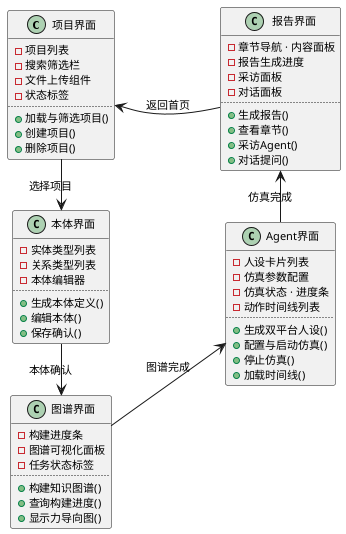

### 3.2.2 界面设计类图

将 §2.5 BCE 分析类图的 5 个边界类合并在一张类图中，同时展示各界面内部的 UI 元素与界面之间的跳转依赖关系。五个界面沿用户流水线依次串联：项目界面作为入口，经由本体界面和图谱界面进入核心仿真链路，最终在报告界面完成报告审阅、对话与 Agent 采访。

**图 3-3 MiroFish 界面设计类图**

**界面属性与操作说明**：

**项目界面**——系统入口，聚合项目管理与项目创建两项职责。项目管理区提供项目列表表格（含名称、状态、创建时间）、搜索筛选输入框、删除按钮及状态标签；项目创建区提供项目名称输入框、多文件拖拽上传组件和提交按钮。核心操作包括加载项目列表、筛选、删除、填写项目名、上传种子文档、提交创建请求，以及通过 `跳转至本体生成()` 进入流水线。该界面对应项目创建与管理两项用例。

**本体界面**——用户从项目列表选择项目后进入。界面提供生成按钮触发 LLM 抽取候选本体，实体类型列表和关系类型列表展示抽取结果，本体编辑器支持用户手动增删改，确认保存按钮持久化最终本体。核心操作包括点击生成本体、编辑本体定义、保存本体，以及通过 `跳转至图谱构建()` 推进到下一步。该界面对应本体定义生成用例。

**图谱界面**——本体确认后自动进入。界面提供构建按钮启动异步三元组抽取与 Zep 写入任务，进度条展示任务完成百分比，图谱可视化面板以 D3 力导向图渲染实体节点与关系边，状态标签标识任务状态。核心操作包括点击构建图谱、查询构建进度、显示图谱，以及通过 `跳转至Agent界面()` 进入仿真链路。该界面对应知识图谱构建用例。

**Agent界面**——聚合人设生成、模拟配置与仿真控制三个功能区域。人设生成区提供生成按钮、实体列表、平台切换标签和人设卡片列表；模拟配置区提供回合数、Agent 数量、话题文本输入框及平台开关与提交按钮；仿真控制区提供启动/停止按钮、状态标签、进度条、动作时间线列表及平台筛选标签。三个区域按流水线顺序解锁，最终通过 `跳转至报告界面()` 进入报告阶段。该界面覆盖 Agent 人设生成、模拟配置与仿真监控三项用例。

**报告界面**——聚合报告查看、采访交互与报告对话三个功能区域。报告查看区提供生成报告按钮、章节导航列表、报告内容面板和进度标签；采访交互区提供 Agent 选择列表、采访问题输入框、发送采访按钮、采访结果面板和采访历史列表；报告对话区提供对话输入框、发送对话按钮和对话历史列表。各区域独立可操作，通过 `返回项目界面()` 回到首页。该界面覆盖报告生成与查看、Agent 采访、报告对话三项用例。

**类间关系说明**：五个界面按顺时针 U 形布局——顶部行依次为项目界面、本体界面、图谱界面，右侧下行至 Agent 界面，底部行回到报告界面，左侧闭合返回项目界面。界面之间的实线箭头反映 §3.2.1 的跳转流程，形成"项目→本体→图谱→Agent→报告→项目"的闭环。所有跳转均通过前端 Vue Router 路由导航实现，界面之间不直接持有对方引用。
