# 第三章 系统设计

> 从零构建 MiroFish 多智能体仿真预测引擎的系统设计方案。

---

## 3.1 系统体系结构设计

MiroFish 采用经典的**分层架构（Layered Architecture）**，将系统划分为表现层、业务逻辑层、数据访问层和实体层四个层次。分层架构是 Web 应用领域最成熟、最稳定的架构风格，其核心原则是**高内聚低耦合**：每层只处理自己职责范围内的事务，层与层之间通过明确的接口交互，上层依赖下层，下层不感知上层。选择分层架构的原因有三：（1）MiroFish 的业务流程呈线性流水线（文档→图谱→人设→仿真→报告），天然适合自上而下的分层调用；（2）前端 Vue 与后端 Flask 的物理分离要求一个清晰的 HTTP 边界层；（3）数据存储涉及文件系统与外部云服务（Zep、LLM API）两种异构后端，数据访问层可以将这种差异封装起来，业务层无需关心数据具体存在哪里。

### 3.1.1 系统包图

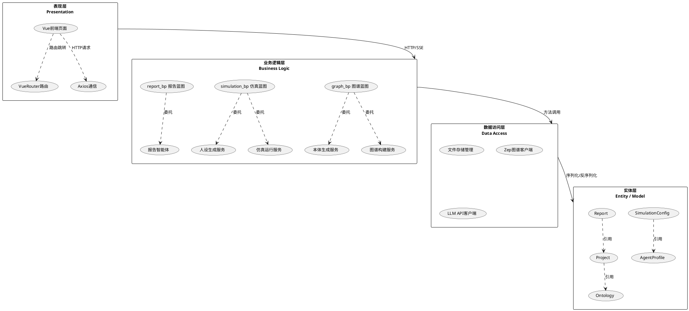

**图 3-1 MiroFish 系统包图（分层架构）**

### 3.1.2 各层职责与交互说明

**表现层（Presentation Layer）**

表现层是用户与系统的交互界面，采用 Vue 3 单页应用（SPA）架构。该层的核心组件包括：五个主页面组件（首页、主流程页、仿真运行页、报告查看页、深度交互页）、Vue Router 管理的前端路由表、以及基于 axios 的 HTTP 通信模块。表现层只负责两件事——渲染界面和发送 HTTP 请求，不包含任何业务逻辑。用户的所有操作（创建项目、生成本体、启动仿真等）都被转化为对后端 REST API 的异步调用，然后根据响应结果更新界面。

**业务逻辑层（Business Logic Layer）**

业务逻辑层是系统的核心，采用 Python Flask 应用工厂模式组织。该层包含三组 Flask 蓝图和五个核心服务类：

- **graph_bp**（项目与图谱蓝图）：对外暴露 `/api/graph/*` 接口，承担项目 CRUD、本体生成、图谱构建任务调度等职责。
- **simulation_bp**（仿真管理蓝图）：对外暴露 `/api/simulation/*` 接口，承担实体读取、人设生成、仿真启动/监控、IPC 采访等职责。
- **report_bp**（报告生成蓝图）：对外暴露 `/api/report/*` 接口，承担报告生成、章节增量推送（SSE）、报告对话等职责。
- **五大服务类**：`OntologyGenerator`（本体生成）、`GraphBuilderService`（图谱构建）、`OasisProfileGenerator`（人设生成）、`SimulationRunner`（仿真子进程管理）、`ReportAgent`（报告智能体）。蓝图作为薄接口层接收 HTTP 请求，具体业务逻辑委托给服务类执行。

蓝图之间的交互以**数据文件为中介**而非直接调用：graph_bp 产出的图谱 ID 写入 Project JSON，simulation_bp 读取该 ID 获取实体；simulation_bp 产出的仿真数据落盘，report_bp 读取后生成报告。这种松耦合设计使三个蓝图可以独立开发、测试和部署。

**数据访问层（Data Access Layer）**

数据访问层封装了所有的数据读写细节，向上层提供统一的数据操作接口。包含三个模块：

- **文件存储管理**：负责 `backend/uploads/` 下所有 JSON、TXT、JSONL 文件的读写。项目、仿真、报告的持久化均通过此模块完成。
- **Zep 图谱客户端**：封装 Zep Cloud API，负责知识图谱中实体和关系的增删查改。
- **LLM API 客户端**：封装 OpenAI 兼容格式的大模型调用，支持请求重试、超时控制和多模型切换。

数据访问层将外部依赖（Zep 云服务、LLM 提供商）集中管理，使得业务逻辑层无需关心 API 密钥、连接池、重试策略等底层细节。

**实体层（Entity / Model Layer）**

实体层定义了系统的核心数据对象，贯穿三层并被所有上层组件共享。五个核心实体分别是：`Project`（项目信息、状态机、文档引用）、`Ontology`（实体类型与关系类型定义）、`AgentProfile`（智能体的人设、性格、平台归属）、`SimulationConfig`（仿真参数：回合数、话题、平台开关）、`Report`（报告元信息、章节列表、生成状态）。实体以 JSON 文件形式落盘，数据访问层负责实体对象与 JSON 之间的序列化和反序列化。

---

## 3.2 用户界面设计

本节从界面跳转流程与界面类结构两个维度，对 MiroFish 前端进行设计。界面数量与职责直接承接自第二章 §2.5 BCE 分析类图的 5 个边界类——原始十个用例对应的 UI01~UI10 按 BCE 归类合并为 5 个界面：项目界面（UI01+UI02）、本体界面（UI03）、图谱界面（UI04）、Agent 界面（UI05+UI06+UI07）、报告界面（UI08+UI09+UI10）。

### 3.2.1 界面跳转顺序图

用户使用 MiroFish 的典型路径为：项目界面创建/管理项目 → 本体界面生成本体 → 图谱界面构建图谱 → Agent 界面完成人设、配置与仿真 → 报告界面查看报告、对话与采访。下图以顺序图形式刻画五个界面之间的跳转关系。

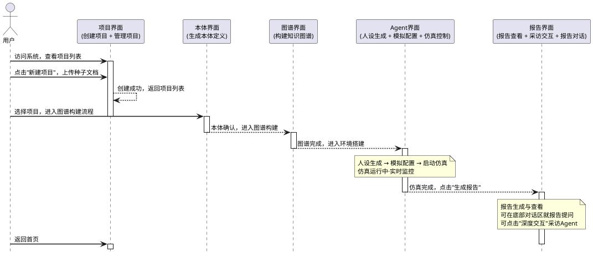

**图 3-2 MiroFish 界面跳转顺序图**

跳转规则概述（与 §2.5 BCE 分析类图映射一致）：

- **项目界面 → 本体界面**：用户在项目界面创建或选择项目后，进入该项目的图谱构建流程，入口为本体界面。
- **本体界面 → 图谱界面**：用户确认 LLM 抽取的本体定义后，自动进入图谱构建步骤。
- **图谱界面 → Agent 界面**：知识图谱构建完成并可视化确认后，进入环境搭建阶段；Agent 界面内部按顺序流转——读取实体 → 生成双平台人设 → 填写仿真参数 → 启动并监控仿真。
- **Agent 界面 → 报告界面**：仿真运行结束（或用户主动停止）后，点击"生成报告"跳转至报告界面。
- **报告界面内部交互**：报告界面聚合了报告查看、报告对话与 Agent 采访三项功能——用户可逐章阅读报告、在底部对话区就报告内容提问、或点击"深度交互"进入采访面板。
- **任意界面 → 项目界面**：通过浏览器返回或导航栏均可回到项目列表首页。

### 3.2.2 界面设计类图

将 §2.5 BCE 分析类图的 5 个边界类展开为界面设计类图。每个类的属性为该界面上的核心 UI 元素（按钮、输入框、列表、标签、可视化组件等），方法为用户在该界面上的交互动作（点击、提交、刷新、跳转等）。每张类图下方附有该界面的详细设计说明。

**（1）项目界面（合并原 UI01 + UI02）**

```plantuml
@startuml
skinparam backgroundColor #FFFFFF
skinparam shadowing false
skinparam defaultFontSize 12

class "项目界面" <<界面>> {
  ' —— 项目管理区 ——
  - 项目列表表格
  - <<input>> 搜索筛选输入框
  - 删除按钮
  - 状态标签
  ' —— 项目创建区 ——
  - <<input>> 项目名称输入框
  - <<input>> 文件上传组件
  - 提交按钮
  --
  + 加载项目列表()
  + 筛选项目()
  + 删除项目()
  + 填写项目名()
  + 上传种子文档()
  + 提交创建请求()
  + 跳转至本体生成()
}
@enduml
```

**图 3-3 项目界面设计类图**

说明：
- 项目列表表格：展示全部历史项目及其名称、状态、创建时间
- 搜索筛选输入框：按项目名称关键字筛选列表（用户输入元素）
- 删除按钮：删除选中项目，点击后需二次确认
- 状态标签：标识项目所处阶段（已创建 / 图谱已完成 / 失败等）
- 项目名称输入框：接收用户输入的项目名称（用户输入元素）
- 文件上传组件：支持 PDF/DOCX/TXT 多文件拖拽上传（用户输入元素）
- 提交按钮：点击后提交项目创建请求至后端
- 加载项目列表()：页面加载时自动拉取最新项目列表
- 筛选项目()：用户输入关键字后实时过滤列表
- 删除项目()：用户确认后删除项目记录
- 填写项目名()：用户在输入框中填写项目名称
- 上传种子文档()：用户拖拽或选择文件上传至系统
- 提交创建请求()：用户点击提交按钮触发项目创建
- 跳转至本体生成()：用户点击项目行进入图谱构建流程

**（2）本体界面（对应原 UI03）**

```plantuml
@startuml
skinparam backgroundColor #FFFFFF
skinparam shadowing false
skinparam defaultFontSize 12

class "本体界面" <<界面>> {
  - 生成按钮
  - 实体类型列表
  - 关系类型列表
  - <<input>> 本体编辑器
  - 确认保存按钮
  --
  + 点击生成本体()
  + 编辑本体定义()
  + 保存本体()
  + 跳转至图谱构建()
}
@enduml
```

**图 3-4 本体界面设计类图**

说明：
- 生成按钮：触发 LLM 从种子文档中抽取候选本体类型
- 实体类型列表：展示 LLM 抽取的候选实体类型（如品牌、用户、话题）
- 关系类型列表：展示候选关系类型（如发布、转发、关注）
- 本体编辑器：支持用户手动增删改实体与关系类型定义（用户输入元素）
- 确认保存按钮：保存编辑后的本体定义并持久化
- 点击生成本体()：用户点击生成按钮触发 LLM 抽取
- 编辑本体定义()：用户在本体编辑器中修改候选类型
- 保存本体()：用户确认后保存最终本体定义
- 跳转至图谱构建()：本体保存后自动进入图谱构建步骤

**（3）图谱界面（对应原 UI04）**

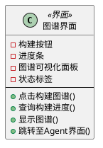

**图 3-5 图谱界面设计类图**

说明：
- 构建按钮：触发异步三元组抽取与知识图谱写入任务
- 进度条：展示异步图谱构建任务的完成百分比（动态元素）
- 图谱可视化面板：以 D3 力导向图实时渲染实体节点与关系边
- 状态标签：标识构建任务状态（构建中 / 已完成 / 失败）（动态元素）
- 点击构建图谱()：用户点击构建按钮启动图谱构建
- 查询构建进度()：前端轮询获取任务进度并更新进度条
- 显示图谱()：构建完成后渲染 D3 力导向图
- 跳转至Agent界面()：图谱构建成功后进入环境搭建与仿真阶段

**（4）Agent 界面（合并原 UI05 + UI06 + UI07）**

```plantuml
@startuml
skinparam backgroundColor #FFFFFF
skinparam shadowing false
skinparam defaultFontSize 12

class "Agent界面" <<界面>> {
  ' —— 人设生成区 ——
  - 生成按钮
  - 实体列表
  - <<input>> 平台切换标签
  - 人设卡片列表
  ' —— 模拟配置区 ——
  - <<input>> 回合数输入框
  - <<input>> Agent数量输入框
  - <<input>> 话题文本输入框
  - <<input>> 平台开关
  - 提交按钮
  ' —— 仿真控制区 ——
  - 启动按钮
  - 停止按钮
  - 仿真状态标签
  - 仿真进度条
  - 动作时间线列表
  - <<input>> 平台筛选标签
  --
  + 读取图谱实体()
  + 生成双平台人设()
  + 查看人设详情()
  + 填写模拟参数()
  + 校验参数()
  + 提交配置()
  + 点击启动仿真()
  + 查询运行状态()
  + 加载时间线()
  + 停止仿真()
  + 跳转至报告界面()
}
@enduml
```

**图 3-6 Agent 界面设计类图**

说明：
- 生成按钮：触发 LLM 为全部实体生成 Twitter 和 Reddit 双平台人设
- 实体列表：展示从知识图谱读取的全部 Agent 实体
- 平台切换标签：在 Twitter 人设与 Reddit 人设之间切换查看（用户输入元素）
- 人设卡片列表：展示每个 Agent 的双平台人设详情（背景故事、性格特征等）
- 回合数输入框：设置仿真运行的总回合数，默认值为 5（用户输入元素）
- Agent数量输入框：设置参与仿真的 Agent 数量上限（用户输入元素）
- 话题文本输入框：输入仿真的初始讨论话题文本（用户输入元素）
- 平台开关：控制 Twitter / Reddit 平台的启用与关闭（用户输入元素）
- 提交按钮：校验参数完整性并生成最终仿真配置文件
- 启动按钮：启动仿真子进程开始运行
- 停止按钮：发送终止命令提前结束仿真
- 仿真状态标签：实时显示仿真 ID、当前回合数及运行状态（动态元素）
- 仿真进度条：展示当前仿真回合的完成进度及预估剩余时间（动态元素）
- 动作时间线列表：按时间倒序展示每轮 Agent 动作流水（动态元素）
- 平台筛选标签：按 Twitter / Reddit 筛选时间线中的动作（用户输入元素）
- 跳转至报告界面()：仿真完成后跳转至报告生成页面

**（5）报告界面（合并原 UI08 + UI09 + UI10）**

```plantuml
@startuml
skinparam backgroundColor #FFFFFF
skinparam shadowing false
skinparam defaultFontSize 12

class "报告界面" <<界面>> {
  ' —— 报告查看区 ——
  - 生成报告按钮
  - 章节导航列表
  - 报告内容面板
  - 进度标签
  ' —— 采访交互区 ——
  - Agent选择列表
  - <<input>> 采访问题输入框
  - 发送采访按钮
  - 采访结果面板
  - 采访历史列表
  ' —— 报告对话区 ——
  - <<input>> 对话输入框
  - 发送对话按钮
  - 对话历史列表
  --
  + 点击生成报告()
  + 加载章节列表()
  + 查看章节内容()
  + 选定Agent()
  + 输入采访问题()
  + 发送采访请求()
  + 查看采访历史()
  + 输入对话问题()
  + 发送对话请求()
  + 查看对话历史()
  + 返回项目界面()
}
@enduml
```

**图 3-7 报告界面设计类图**

说明：
- 生成报告按钮：触发 ReportAgent 开始逐章生成预测报告
- 章节导航列表：展示报告章节目录树，生成过程中逐章解锁
- 报告内容面板：以 Markdown 格式渲染的报告正文阅读区
- 进度标签：显示 ReportAgent 当前生成章节及整体进度（动态元素）
- Agent选择列表：展示全部仿真 Agent 及其人设摘要，支持多选
- 采访问题输入框：接收用户向 Agent 提出的采访问题文本（用户输入元素）
- 发送采访按钮：通过 IPC 通道将问题转发至仿真子进程中的目标 Agent
- 采访结果面板：展示目标 Agent 基于角色设定生成的回答
- 采访历史列表：记录当前会话中所有的采访问答对
- 对话输入框：接收用户就报告内容提出的问题文本（用户输入元素）
- 发送对话按钮：将问题与报告上下文一并发送至 ReportAgent
- 对话历史列表：以气泡形式展示用户与 ReportAgent 的全部对话记录
- 返回项目界面()：用户点击返回按钮回到项目列表首页

### 3.2.3 界面草图

在详细设计之前，先以手绘草图形式快速表达五个核心界面的布局与交互意图。草图侧重传达界面结构而非视觉细节，与 §3.2.2 的类图一一对应。

**项目界面草图**

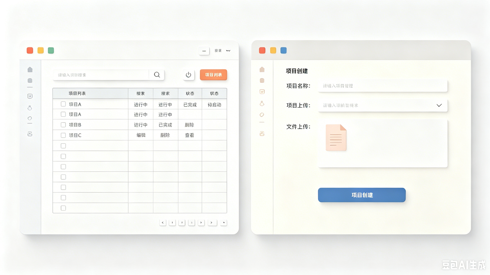

*图 3-8-a 项目界面草图（方案一）*

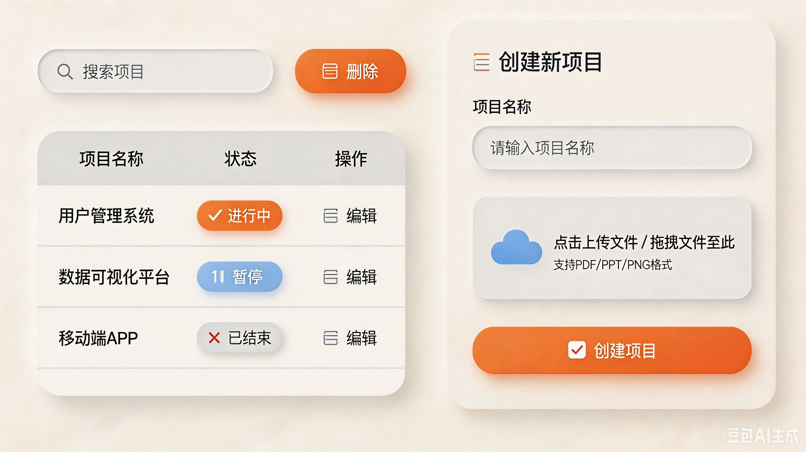

*图 3-8-b 项目界面草图（方案二）*

**本体界面草图**

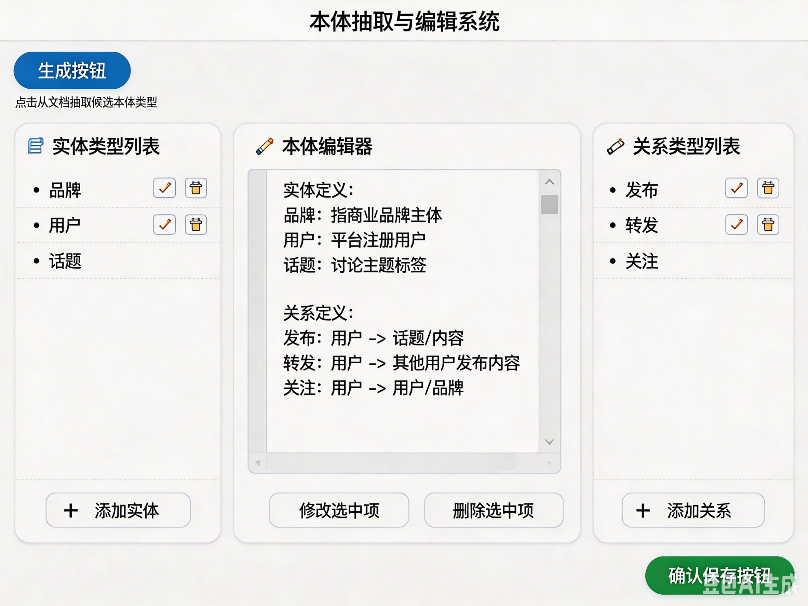

*图 3-9 本体界面草图*

**图谱界面草图**

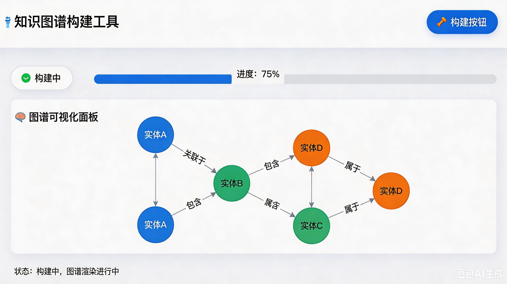

*图 3-10 图谱界面草图*

**Agent 界面草图**

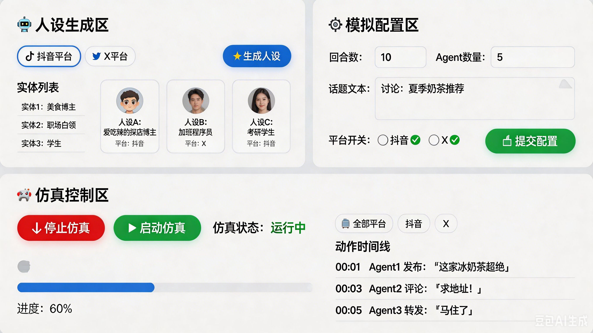

*图 3-11 Agent 界面草图*

**报告界面草图**

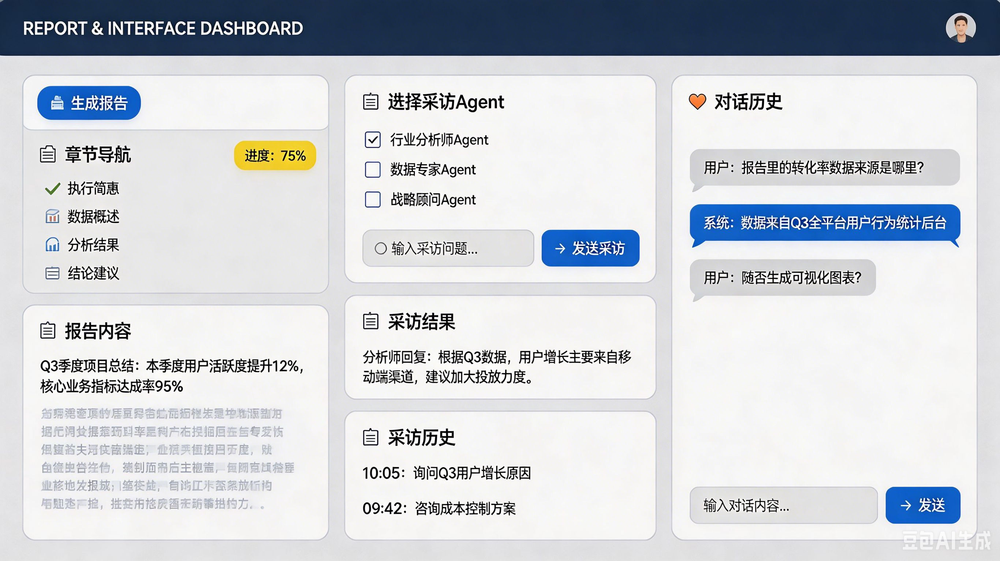

*图 3-12 报告界面草图*
